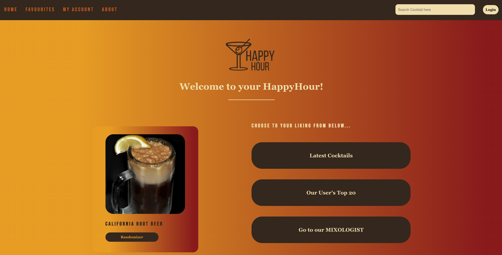

## Welcome to the HappyHour Application!

**About the application** 

HappyHour is a cocktail-app about the wonderful and abundant world of cocktails and for people that already are or want to become cocktail lovers.

It is supposed to help the user to get a better overview about which cocktails are hot and new, how to prepare them and what goes into each one of them.

Cheers and enjoy your own personal HappyHour. 

Please see below the homepage of the application.
As a registered user you can access all important functionalities from here: 



## Getting started with HappyHour App

After you have cloned this repository to your local machine, please install `node_modules` by running the following command:
```
npm install
```

Once finalized you will be able to start the application with the following command: 
```
npm start
```
**OR:** use (if you use Webstorm) use the Webstorm button (npm start). 

Open [http://localhost:3000](http://localhost:3000/) to view the page in the browser.

If you want to stop running the page in the browser use CTRL + C in the terminal. 
You can rerun the browser with the command mentioned above. 

## Backend for the HappyHour App

The educational backend of Novi Hogeschool has been used for this project. 
**Please note**: the manual to this backend are in Dutch only.

[https://github.com/hogeschoolnovi/novi-educational-backend-documentation](https://github.com/hogeschoolnovi/novi-educational-backend-documentation)


## Access for users 

   **1. **Registration and Login**** 
  
After registering to the application on the registration page, then user will be able to log   in with his **USERNAME** and **PASSWORD.** A personal token is being saved automatically in the backend. The user will **NOT** need the access token to log in.  

   **2. Password reset:** 

   There is no possibility to reset your password or to access it in another way (f.e. through a  reset-email) once forgotten.

**Please note**:** 

the personal token and therefore the access rights expire after a couple of hours. 

**3. Making a new account after access rights expire:** 

The user can make a new account after his access rights expire. 
The system generates a new personal token that is connected to the user.

**Note:** 

The user does not have to be able to retrieve the access token, as it will be automatically stored by the backend. 

## User roles 

All users will be able to: 

1. Register 
2. Login 

For **non-registered users** it is possible to:

1.Search for cocktail by name (searchbar on homepage).
2.Search for cocktails by ingredient (searchbar on search page).
3.View newly added cocktails (latest button on homepage).
4.View the top twenty of all cocktails (top twenty button on homepage).
5.Use the randomizer feature (randomizer button on homepage).
6.Use the mixologist feature (mixologist button on homepage). 
7.View cocktails: including images, the cocktail-name & cocktail ingredients. 


A **registered user** can additionally: 

1. Access all the features mentioned above. 
2. Access his/her **My Account** page.
3. Access his/her **Favourites page**
4. Add and remove cocktails to his/her **Favourites page.** 
5. View, once cocktails are saved to the **Favourites page**, the instructions for the preparation of the cocktails. 


## Admin access / admin roles

There have been no admin roles created for this project. 


## API and API-key 

For this project[ TheCocktailDB](https://www.thecocktaildb.com/) has been used. 
The API-key to access-only API-methods will be added to the pdf-file of this frontend project and added to this section under "API-key". 


**Aanmerking voor de nakijkende docent: ** 

Ik heb deze handleiding bewust in het Engels geschreven, om deze ook voor internationale studenten beschikbaar te maken.


##Information about React App 
Please see below

# Getting Started with Create React App

This project was bootstrapped with [Create React App](https://github.com/facebook/create-react-app).

## Available Scripts

In the project directory, you can run:

### `npm start`

Runs the app in the development mode.\
Open [http://localhost:3000](http://localhost:3000) to view it in your browser.

The page will reload when you make changes.\
You may also see any lint errors in the console.

### `npm test`

Launches the test runner in the interactive watch mode.\
See the section about [running tests](https://facebook.github.io/create-react-app/docs/running-tests) for more information.

### `npm run build`

Builds the app for production to the `build` folder.\
It correctly bundles React in production mode and optimizes the build for the best performance.

The build is minified and the filenames include the hashes.\
Your app is ready to be deployed!

See the section about [deployment](https://facebook.github.io/create-react-app/docs/deployment) for more information.

### `npm run eject`

**Note: this is a one-way operation. Once you `eject`, you can't go back!**

If you aren't satisfied with the build tool and configuration choices, you can `eject` at any time. This command will remove the single build dependency from your project.

Instead, it will copy all the configuration files and the transitive dependencies (webpack, Babel, ESLint, etc) right into your project so you have full control over them. All of the commands except `eject` will still work, but they will point to the copied scripts so you can tweak them. At this point you're on your own.

You don't have to ever use `eject`. The curated feature set is suitable for small and middle deployments, and you shouldn't feel obligated to use this feature. However we understand that this tool wouldn't be useful if you couldn't customize it when you are ready for it.

## Learn More

You can learn more in the [Create React App documentation](https://facebook.github.io/create-react-app/docs/getting-started).

To learn React, check out the [React documentation](https://reactjs.org/).

### Code Splitting

This section has moved here: [https://facebook.github.io/create-react-app/docs/code-splitting](https://facebook.github.io/create-react-app/docs/code-splitting)

### Analyzing the Bundle Size

This section has moved here: [https://facebook.github.io/create-react-app/docs/analyzing-the-bundle-size](https://facebook.github.io/create-react-app/docs/analyzing-the-bundle-size)

### Making a Progressive Web App

This section has moved here: [https://facebook.github.io/create-react-app/docs/making-a-progressive-web-app](https://facebook.github.io/create-react-app/docs/making-a-progressive-web-app)

### Advanced Configuration

This section has moved here: [https://facebook.github.io/create-react-app/docs/advanced-configuration](https://facebook.github.io/create-react-app/docs/advanced-configuration)

### Deployment

This section has moved here: [https://facebook.github.io/create-react-app/docs/deployment](https://facebook.github.io/create-react-app/docs/deployment)

### `npm run build` fails to minify

This section has moved here: [https://facebook.github.io/create-react-app/docs/troubleshooting#npm-run-build-fails-to-minify](https://facebook.github.io/create-react-app/docs/troubleshooting#npm-run-build-fails-to-minify)
